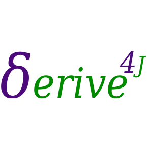

import { Appear, Head, Image } from 'mdx-deck'
import { FullScreenCode, Invert, Split, SplitRight } from 'mdx-deck/layouts'
import { CodeSurfer } from "mdx-deck-code-surfer"
import nightOwl from "prism-react-renderer/themes/nightOwl"

export { notes as theme } from 'mdx-deck/themes'

<Head>
  <title>Encoding FP in Java</title>
  <meta itemprop="name" content="Encoding FP in Java" />
  <meta itemprop="description" content="Why shouldn't I FP just because it's Java?" />
  <meta itemprop="image" content="https://pbs.twimg.com/profile_images/582781179893530625/N7Zh6W6M_bigger.jpg" />
  <meta name="twitter:card" content="summary_large_image" />
  <meta name="twitter:site" content="@jb9i" />
  <meta name="twitter:title" content="Encoding FP in Java" />
  <meta name="twitter:description" content="Why shouldn't I FP just because it's Java?" />
  <meta name="twitter:image" content="https://pbs.twimg.com/profile_images/582781179893530625/N7Zh6W6M_bigger.jpg" />
  <meta property="og:title" content="Encoding FP in Java" />
  <meta property="og:type" content="article" />
  <meta property="og:url" content="https://gracious-hypatia-aac58b.netlify.com" />
  <meta property="og:image" content="https://pbs.twimg.com/profile_images/582781179893530625/N7Zh6W6M_bigger.jpg" />
  <meta property="og:description" content="Why shouldn't I FP just because it's Java?" />
  <meta property="og:site_name" content="Encoding FP in Java" />
  <meta property="article:published_time" content="2013-09-17T05:59:00+01:00" />
  <meta property="article:modified_time" content="2013-09-16T19:08:47+01:00" />
  <meta property="article:section" content="Article Section (React? Design?)" />
</Head>

# Encoding FP in Java
is easier than in Go!


### `new LambdaWorld<Cadiz>(2018L)`


```notes
Why not go? the bare minimum I need is generics
ie. a lang where system-F formalism more-or-less apply for reasoning about types.

For haskell dev: translate your jargon and knowledge when navigating in 00-land.
For Java dev: demytify FP technics by implementing them in Java.
Actual practical goal: gains more technics for writing working software.
```

---
## This presentation is available at


https://gracious-hypatia-aac58b.netlify.com/

(Alt-P for presenter notes)

---
export default Split

twitter: @jb9i / github: @jbgi




## Jean-Baptiste Giraudeau

* heavy French accent
* too many years of Java experience
* last 3 years as Scala programmer
* core contributor of Scalaz and FunctionalJava
* Author of [Derive4J](https://github.com/derive4j/derive4j)
* Guilty of torturing Java and Scala into confessing their hiden FP abilities.

---
## Thesis of this talk

Typed Functional Programming is
the most pratical way to write
maintainable, working software.

<Appear>
<p>Not gonna argue this.</p>
<p>Typed Functional Programming require at the minimum a type system that can encode System F.</p>
</Appear>

---
## Java is partialy supportive of this thesis
#### Java can encode System F, but, out-of-the-box, is missing:
<ol>
<li>IO effect tracking</li>
<li><a href="https://people.mpi-sws.org/≃dreyer/tor/papers/wadler.pdf">Parametricity</a></li>
<li>Native sum types / GADT</li>
<li>Extensibility other than inheritance</li>
<li>Tail call optimization</li>
<li>Support for Lazy evaluation</li>
<li>HKT (aka. type constructor polymorphism, ie. System Fω)</li>
</ol>

```notes
Parametricity (most important property) in Java would means that generic methods behave the same whatever the type arguments.
If your PL does not have generics or equivalent, this talk does not apply.

Native sum types are coming, maybe. but everyone will stay on Java11 for the next ten years.

TCO: not counting on it before long.

HKT: eg. write code that would work for any type that has a map function.
(in Java8: Future, Optional, Stream)
Do you imagine writing something as simple as a mincraft library without
type constructor polymorphism? (DataFixerUpper)

```
---
## Encoded in this talk

Desired                        | Encoded with
------------------------------ | -------------------------------------------------------------------------
[X] IO effect tracking         | No side effects + `IO<A>` (from FunctionalJava).
[X] Parametricity              | Ignoring everything that can break it.
[X] sum types / GADT           | `List<A>{ <X> X cases(X nil, F2<A, List<A>, X> cons);}` (Scott encoding).
[X] Expression Problem solution| Object algebras
[X] Lazy evaluation            | `static <A> List<A> lazy(F0<List<A>> as)` (with memoization).
[/] HKT                        | `List<A>` => `Hk<List<?>, A>` (Unsafe).

```notes
TC0: use while loop. But TCO is no magic. when It doesn't: list.reverse.foldLeft or:
Lazy contructructor, via memoization of suspended expression or Trampoline.
HKT: unsafe but required for writing any basic mincraft libray, I mean encoding profunctor optics.
```

---
## Can break Parametricity

hence, in pure code, we completly ignore the existence of:

 - `null`
 - `instanceOf` / type casts
 - non-deterministic exceptions
 - all methods on `java.lang.Object`

```notes

Parametricity:  in particular, java.lang.Object as no methods,
  no instanceOf or casting (thus excluding making use of reyfied generics in language that have them),
  We never catch exceptions, we never test for nullity.
  Doing so is not programming it is kind of co-programming,
  ie. code that reason about the execution of a program behave
  (checking the program terminate correctly).
  Doing so with IO is OK, as doing IO is co-programming.
```

---
## How to prove an encoding is correct?

1. Hot(t) take: if two types are isormorphic then they are the same.


2. We ignore bottom values, [including null](https://chris-martin.org/2017/null-as-bottom),
   as per [Fast and Loose Reasoning is Morally Correct](https://www.cs.ox.ac.uk/jeremy.gibbons/publications/fast+loose.pdf).

```notes
Parametricity:  in particular, java.lang.Object as no methods,
  no instanceOf or casting (thus excluding making use of reyfied generics in language that have them),
  We never catch exceptions, we never test for nullity.
  Doing so is not programming it is kind of co-programming,
  ie. code that reason about the execution of a program behave
  (checking the program terminate correctly).
  Doing so with IO is OK, as doing IO is co-programming.

TC0: use while loop. But TCO is no magic. when It doesn't: list.reverse.foldLeft or:
Lazy contructructor, via memoization of suspended expression or Trampoline.
```
---
## Using cardinality to prove isomorphism

Same cardinality ≃ Isormorphic

Type           | Cardinality
-------------- | -------------
`Void`         | 0
`Unit` / `()`  | 1
`Boolean`      | 2
`Either<A, B>` | A + B
`P2<A, B>`     | A * B
`F<A, B>`      | B<sup>A</sup> <Appear>(need A tests)</Appear>


---
<CodeSurfer
title="What about polymorphic functions??"
  notes="We don't know the cardinality of A!"
  code={require("!raw-loader!./examples/PolyF.java")}
  lang="java"
  showNumbers={false}
  dark={false} />
---
## Yoneda to the rescue

If `f` is a Functor, then:

`(∀ x. (a -> x) -> f x)` ≃ `f a`

Equivalences   | Step
-------------- | -------------
`∀ x. x -> x`  | Introduce unit, `x` ≃ `() -> x`:
`∀ x. (() -> x) -> x`  | Introduce `Id` functor (`Id x = x`):
`∀ x. (() -> x) -> Id x`      | Apply Yoneda:
`Id ()` | `Id x = x`:
`()`     | Q.E.D.

```notes
Alternativeley: case analysis, taking advantage of basic properties of parametric functions:
 1. all generic values in the result must come from the argument.
 2. behavior does not depends on generics arguments
```
---
<CodeSurfer
title="Counting polymorphic types"
  code={require("!raw-loader!./examples/PolySolve.java")}
  lang="java"
  showNumbers={false}
  dark={false}
  steps={[
    { lines: [6], notes: "x^a * x^b = x^(a+b)" },
    { lines: [7], notes: "Yoneda with Id" },
    { lines: [8, 9], notes: "≃ Either a b   (Q.E.D.)" },
    { lines: [12], notes: "Cases analysis" },
    { lines: [13], notes: "two possible a to chose from: (a, a) has 2*2=4 inhabitants" },
    { lines: [13], notes: "bool value can be used to change behavior" },
    { lines: [13], notes: "usual formula: 4^2 = 16 possible implementations" },
    { lines: [14], notes: "Only one a available: (a,a) has 1*1 = 1 inhabitants." },
    { lines: [14], notes: "1^2 = 1 possible implementation" },
    { lines: [15, 16], notes: "# possible impl. = |Left case| x |Right Case| = 16. But need only 2 tests." },
  ]}
   />
---

<CodeSurfer
title="Church/Scott encoded Either"
  code={require("!raw-loader!./examples/Either.java")}
  lang="java"
  showNumbers={false}
  dark={false}
   />

```notes
This encoding is also very 
```
---

<CodeSurfer
title="Equivalent using internal visitor"
  code={require("!raw-loader!./examples/EitherCases.java")}
  lang="java"
  showNumbers={false}
  dark={false}
  steps={[
    { range: [3, 6], notes: "Object are record of functions, right." },
    { range: [11, 13] }
  ]}
   />

---

<CodeSurfer
title="Easy extensibility via contravariance"
  code={require("!raw-loader!./examples/These.java")}
  lang="java"
  showNumbers={false}
  dark={false}
  steps={[
    { range: [3, 4], notes: "Adding a new case to Either cases" },
    { range: [9 ,10], notes: "Varying a function via method reference..." },
    { range: [9 ,10], notes: "solving the expression problem for non-inductive ADT along the way!" }
  ]}
   />

```notes
Church encoded ADT are polymorphic functions, and functions are contravariant:
subtyping visitor => new super type! 

Very useful for versionned data types, like events in event-source system, to convert from old to new version.
Override and default method can be use to set default value for new field.

```

---

<CodeSurfer
title="On Derive4J steroids!!"
  code={require("!raw-loader!./examples/EitherDerive4J.java")}
  lang="java"
  showNumbers={false}
  dark={false}
  steps={[
    { lines: [1,2,3,4], notes: "An annotation processor, compatible with most FP libs" },
    { lines: [2], notes: "Can derive FunctionalJava type classes!" },
    { lines: [2], notes: "Actually external extension written in 10 lines. also exist: Json codecs" },
    { lines: [7, 8], notes: "Generate constructors (in a Eithers class)" },
    { range: [15, 17], notes: "Pattern matching via `case of` syntax" },
    { range: [10, 13], notes: "as well as `cases` (ie. `Lambda-case`) syntax..." },
    { lines: [17], notes: "With compile time exhaustive check!" },
    { lines: [20, 21], notes: "Implementing map via the generated lens-sytle (polymorphic) modifiers!" },
  ]}
   />

   ```notes
When you only need some of the generated stuff,
Derive4J allows to specify only what must be generated.
```
---
## The expression problem


(credit: [From Object Algebras to Finally Tagless Interpreters](https://oleksandrmanzyuk.wordpress.com/2014/06/18/from-object-algebras-to-finally-tagless-interpreters-2/))
---
### Adding new interpreters


Easy with ADT.
---
### Adding new cases


How to do that while reusing existing interpreter without modification?
---
<CodeSurfer
title="Object-algebra interfaces"
  code={require("!raw-loader!./examples/ExpAlg.java")}
  lang="java"
  showNumbers={false}
  dark={false}
  steps={[
    { range: [1, 8], notes: "First compile unit" },
    { range: [10, 16], notes: "Second compile unit" },
    { range: [18, 20], notes: "Reified: Church encoding, data-as-fold/catamorphism" },
  ]}
  />

  ```notes
Using two interpreter parameters instead of inheritance is also possible / necessary to avoid multiple inheritance situations.
Replace explicit interpreter parameter with type class constraints: tagless final encoding!
```
---
<CodeSurfer
title="Interpreters: Object algebras"
  code={require("!raw-loader!./examples/ExpAlgInstance.java")}
  lang="java"
  showNumbers={false}
  dark={false}
  steps={[
    { range: [1, 10], notes: "First compile unit" },
    { range: [13, 18], notes: "Second compile unit" },
  ]}
  />

```notes
Interpreter of first compile unit can be used without modification.
```
---
## Limitation of final tagless / object-algebra encoding

Programs are a "monolitic" fold.

Manipulating each part as first-class values (initial algebra) simplify some tasks,
eg. serialization / delegation to GPU.
or just for the simpler API!

Hopefully there is an isomorphism between the two encoding (Lambek’s theorem).

```notes
 Introducing the initial encoding in two steps
```
---
<CodeSurfer
title="Step 1: Object-algebras are F-algebras"
  code={require("!raw-loader!./examples/ExpF.java")}
  lang="java"
  showNumbers={false}
  dark={false}
  steps={[
    { range: [1, 8], notes: "data ExpF = Lit Int | Add Int Int" },
    { lines: [10], notes: "type ExpAlg a = ExpF a -> a" },
    { lines: [10], notes: "Use ExpF.Cases<A, A> instead of ExpAlg<A> for maximum reuse." },
    { range: [12, 18], notes: "data ExpMulF = Lit Int | Add Int Int | Mul Int Int  " },
    { lines: [12], notes: "Use '-parameters' flag of javac." },
  ]}
  />

```notes
Support for type aliases would be nice.
```
---
<CodeSurfer
title="Step 2: Exp as Fixed-point of ExpF"
  code={require("!raw-loader!./examples/FixExpF.java")}
  lang="java"
  showNumbers={false}
  dark={false}
  steps={[
    { range: [1, 4], notes: "data Exp = Lit Int | Add Exp Exp" },
    { range: [1, 4], notes: "This is also the Scott encoding of inductive data types" },
    { range: [6, 8], notes: "data ExpMul = Lit Int | Add ExpMul ExpMul | Mul ExpMul ExpMul" },
    { range: [10, 17], notes: "A initial algebra + catamorphism = Apply Lambek for solving the expression problem for inductive data types." },
    { lines: [12], notes: "Generated by derive4J: the initial algebra of for the F-algebras: the constructors of ExpMul." },
    { lines: [16], notes: "Also generated by derive4J: catamorphism for inductive types: use an object-algebra to interpret the corresponding initial encoding" },
    { lines: [14], notes: "Also generated by derive4J: lazy suspend the computation of a data type inside the type it-self (aka. a thunk)" },
    { range: [20, 21], notes: "ExpF can also be used for defining Exp generators, using a seed as carrier type of a terminal co-algebra (anamorphism)." },
  ]}
  />

```notes
Use of the lazy constructor give use the same lazy sementic as haskell, on-demand.
Necessary to avoid stack-overflows while still supporting potentially infinite data-structures.
```

---
## On the usefulness of lazy evaluation 
aka. call-by-name with sharing.

Allows to implement many operation in the cleanest FP way.

(operation that benefits from TCO (eg. foldLeft) still need while loops).

---
<CodeSurfer
title="Eg. Lazy List"
  code={require("!raw-loader!./examples/List.java")}
  lang="java"
  showNumbers={false}
  dark={false}
  steps={[
    { range: [1, 4], notes: "Using annotation to define field names" },
    { range: [6, 10], notes: "filter via catamorphism" },
    { range: [18, 20], notes: "append via catamorphism" },
    { range: [12, 16], notes: "bind via catamorphism" },
    { range: [22, 31], notes: "Derive4J generated cata method" },
  ]}
  />
---

<CodeSurfer
title="Mandatory fibonacci, using fix point combinators"
  code={require("!raw-loader!./examples/Fib.java")}
  lang="java"
  showNumbers={false}
  dark={false}
    steps={[
      { range: [1, 5], notes: "Scott encoding of an infinite stream" },
    { range: [7, 13], notes: "Get nth value: while loop" },
    { range: [23, 25], notes: "fibs = 0 : 1 : zipWith (+) fibs (tail fibs)" },
    { range: [27, 33], notes: "zipWith via `F2` fix combinator" },
    { range: [35, 39], notes: "fix combinator" },
    { range: [41, 49], notes: "fix combinator for F" },
    { range: [51, 59], notes: "fix combinator for F2" },
  ]}
  />
---

<CodeSurfer
title="Implementation of lazy constructor"
  code={require("!raw-loader!./examples/Lazy.java")}
  lang="java"
  showNumbers={false}
  dark={false}
  steps={[
    { range: [5, 28], notes: "Thread-safe, tampolined lazy thunk" },
  ]}
  />
---

## Back to F/Object algebras

No HKT => cannot parametrize carrier type. Solutions:
 - GADT (but no more extensible)
 - Unsafe HKT encoding

For unsafe encoding: see the [Derive4J/HKT project](https://github.com/derive4j/hkt) (provide partial safety)
and application in [Streams à la carte: Extensible Pipelines with Object Algebras](http://biboudis.github.io/papers/streamalg-ecoop15.pdf)

```notes
This may be needed for richer DSL with additional type-safety, or to support dynamic computations (monad).
```

---
<CodeSurfer
title="GADT in Java!"
  code={require("!raw-loader!./examples/Term.java")}
  lang="java"
  showNumbers={false}
  dark={false}
  steps={[
    { range: [1, 13], notes: "TypeEq: a witness of type equality." },
    { range: [16, 27], notes: "haskell-98 style GADT; enforcing the type argument via TypeEq" },
    { range: [29, 35], notes: "Witness is used to recover lost type equality." },
    { range: [37, 43], notes: "Type equality is known at construction." },
  ]}
  />
---
## Other nice uses of GADT

- single method services:
```java
interface Service {
  <R> IO<R> execute(Command<R> cmd);
}
```

- Almost free (actually initial style) monads (see eg. [eventsrc4j](https://github.com/jbgi/eventsrc4j/)).

---
---
<CodeSurfer
title="Pick at initial style monad in Java!"
  notes="TypeEq avoid the use of continuations"
  code={require("!raw-loader!./examples/AlmostFreeMonad.java")}
  lang="java"
  showNumbers={false}
  dark={false}
  />
---


## Further reading
 
 * [Counting type inhabitants](https://alexknvl.com/posts/counting-type-inhabitants.html)
 * [Extensibility for the Masses Practical Extensibility with Object Algebras](https://www.cs.utexas.edu/~wcook/Drafts/2012/ecoop2012.pdf)
 * [Typed Tagless Final Interpreters](http://okmij.org/ftp/tagless-final/course/lecture.pdf)
 * [F-Algebras](https://bartoszmilewski.com/2017/02/28/f-algebras/)
 * [Fun with phantom types](https://www.cs.ox.ac.uk/ralf.hinze/publications/With.pdf)
 * [Lightweight higher-kinded polymorphism](https://www.cl.cam.ac.uk/≃jdy22/papers/lightweight-higher-kinded-polymorphism.pdf)
 * [Adventures in Parametric Polymorphism](https://www.youtube.com/watch?v=Tc9vs_HFHVo)

---

# That's all F-olks!

and remember:

<b>"Generics should be the tool of choice for abstracting over types."</b>

_Brian Goetz_

(and "<? super/extends >" makes you lose that game)

```notes
 Hopefully this will give you ideas to level up your Java!

 One last tip: to make maximal use of method reference and type inference in Java:
 never overload any method, in particular avoid static methods with same name as an instance method
 (safest: have all static methods in another class, eg `List` and `Lists` for static methods)
```
---

## And now let's try
this GADT-based service:

```java
interface Speaker {
  <Answer> Option<Answer> ask(Question<Answer> q);
}
```
